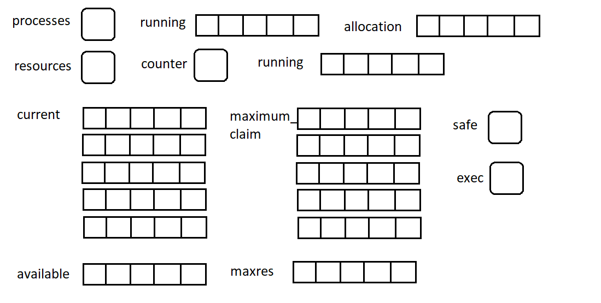
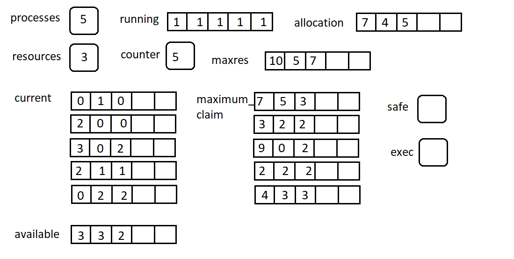

# Bankers Algorithm

```c
#include <stdio.h>

int current[5][5], maximum_claim[5][5], available[5];
int allocation[5] = {0, 0, 0, 0, 0};
int maxres[5], running[5], safe = 0;
int counter = 0, i, j, exec, resources, processes, k = 1;
```
- ***resources*** indicate number of resources
- ***processes*** indicate number of processes
- ***current[][]*** indicate the already allocated resources to the processes
- ***maximum_claim[][]*** indicate the needed resources that processes need
- ***allocation[]*** indicate the current total resources already allocated
- ***maxres[]*** indicate the the absolute total resources available
- ***available[]*** indicate maxres[] - allocation[] (current resources available to be allocated)
- ***running[]*** indicate the state of process (1 for running and 0 for terminated)
- ***exec*** indicate current process state
- ***safe*** indicate flag to check if process is safe to execute or not
---
```c
scanf("%d", &processes);

for (i = 0; i < processes; i++)
{
running[i] = 1;
counter++;
}

scanf("%d", &resources);
```
- user inputs	number	of	***processes***
-	allocate	***running[]***	1D array as 1
- update ***counter*** as number of resources
-	user inputs number of ***resources***
---
```c
for (i = 0; i < resources; i++)
{
scanf("%d", &maxres[i]);
}
```
- user inputs the current available resources into ***maxres***
---
```c
for (i = 0; i < processes; i++)
{
for(j = 0; j < resources; j++)
{
scanf("%d", &current[i][j]);
}
}
 ```
 - user inputs resources already allocated to processes into ***current[][]***
 ---
 ```c
 for (i = 0; i < processes; i++)
{
for(j = 0; j < resources; j++)
{
scanf("%d", &maximum_claim[i][j]);
}
}
```
- user inputs the resources needed to be completed into ***maximum_claim[][]***
---
```c
for (i = 0; i < processes; i++)
{
for (j = 0; j < resources; j++)
{
allocation[j] += current[i][j];
}
}
```
- ***allocation[]*** for each resource is calculated by taking the sum of resources already allocated 
---
```c
for (i = 0; i < resources; i++)
{
available[i] = maxres[i] - allocation[i];
}
```
- ***available[]*** is calculated by subtracting already allocated resources from absolute total available resources
- all user input is taken at this point, next we check if the processes are safe to be executed or not
---
```c
while (counter != 0){
  safe = 0;
  for(i = 0; i < processes; i++){
    if (running[i]){
      exec = 1;
      for(j = 0; j < resources; j++){
        if (maximum_claim[i][j] - current[i][j] > available[j]){
          exec = 0;
          break;
        }
      }
      if (exec){
        printf("\nProcess%d is executing\n", i + 1);
        running[i] = 0;
        counter--;
        safe = 1;
        for (j = 0; j < resources; j++){
          available[j] += current[i][j];
        }
        break;
      }
    }
  }
  if (!safe){
    printf("\nThe processes are in unsafe state.\n");
    break;
  }
  else{
    printf("\nThe process is in safe state");
    printf("\nAvailable vector:");
    for (i = 0; i < resources; i++){
      printf("\t%d", available[i]);
    }
    printf("\n");
  }
}
```
- check if the counter is zero
- if not, execute while loop

***in while loop:***

- set safe to 0
- check if each process is running in the order they are in the matrix

***if running is 1:***

- set exec to 1
- check if resources can be allocated to the resources from current available resources or not

***if true:***

- set the running of that process to 0 to indicate process is terminated
- set safe to 1 to indicate the process is safe
- reallocate the resource back into current available resources
- increment counter

***if false:***

- set safe as 0
- check next for next process if there are more processes
- else terminate algorithm

***if running is 0:***

- check for next process

***if counter is 0***

- terminate alogorithm
---
## Example:
***MAX RESOURCES:***
- A = 10
- B = 5
- C = 7


- initialize resources:


- allocation of user values

